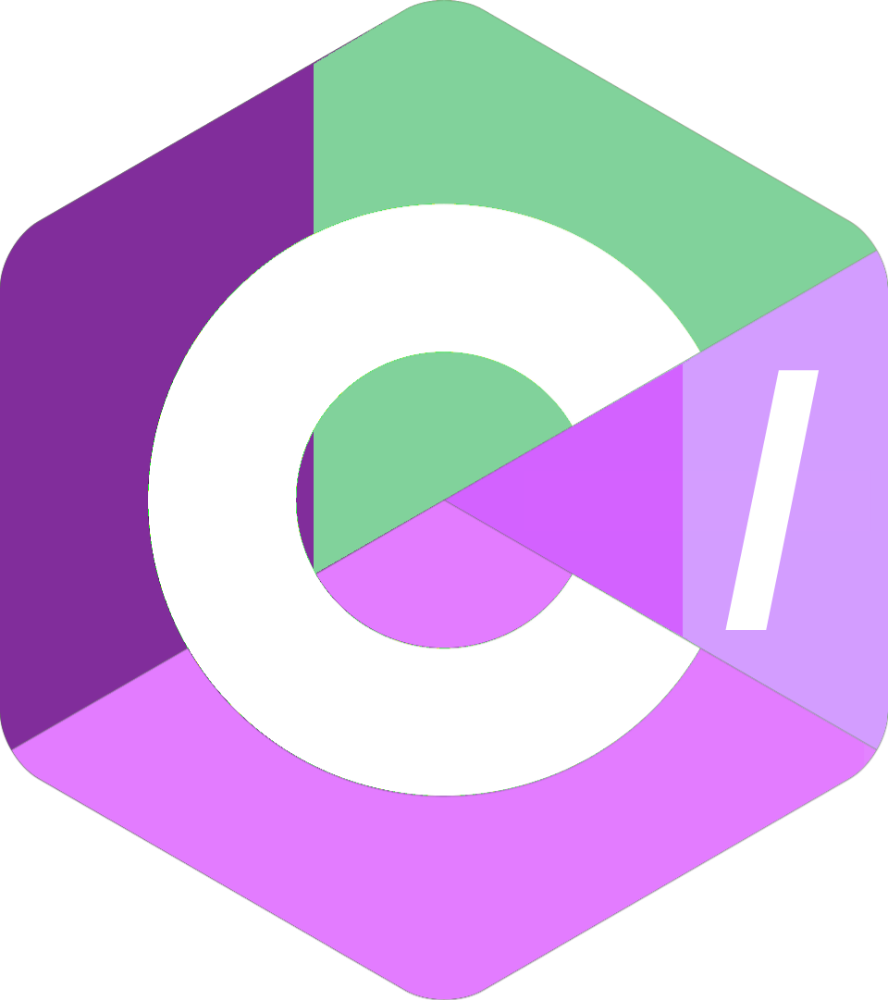

<h1 style="font-weight:bold;"> C/ Programming Language.</h1>
<blockquote>
  welcome to main page of this project. If you came for the source, this quick explanation might help and clarify things. csc: There is an intermediate language in these source files. A language that is converted to assembly and then converted to an object file with NASM and then linked to an executable file. It is going to be integrated into the interpreter itself soon.
</blockquote>
<h1 style="font-weight:bold;">Why C/?</h1>
We all love C, but at the same time, it's difficult to use in projects and working with pointers makes many people die when writing it. But the goal of C/ is almost the same. Basically, C/ wants to have a simple and functional syntax like Turbo C, easy to understand and work with, but in a modern environment.
<h1>Current status</h1>
Well, well, well, right now the project is in alpha mode. That means it's only released for debugging and it's full of bugs! And it's fixing problems and testing new features. So it's not suitable for use and it's not predictable to some extent. And it's more educational than industrial.
